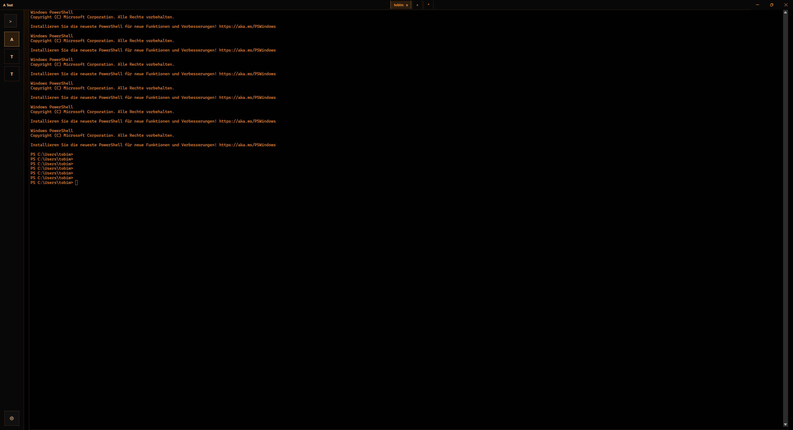
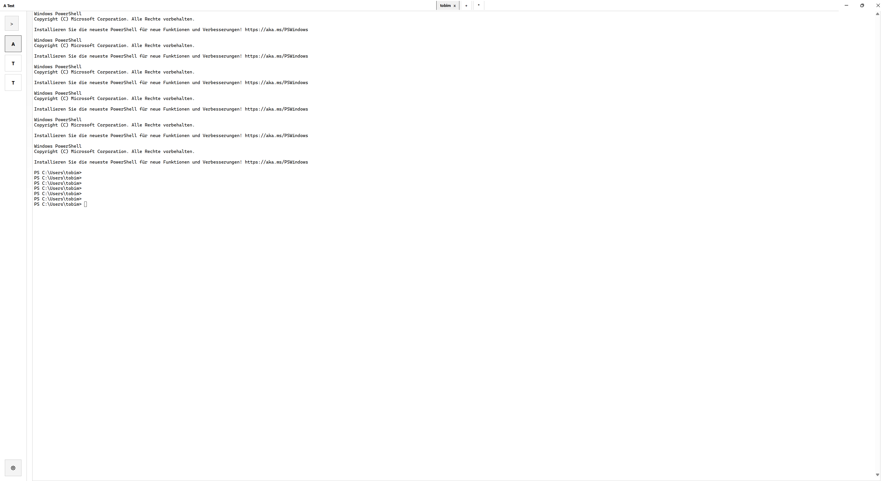

# TermBag

TermBag is a Windows-first desktop app for keeping terminal work organized by project without turning the terminal into a full IDE.

It groups tabs under projects, remembers what you were working on, restores visible history on restart, and keeps the actual shell experience front and center.

## Screenshots

### Dark Theme



### Light Theme



## Current Status

This repository currently contains the **Phase 1** implementation.

Phase 1 is focused on:

- project-based terminal workspaces
- multiple shell tabs per project
- local persistence
- lazy restore
- project-scoped command recall
- a usable desktop UI for daily local terminal work

Phase 1 is already implemented and currently builds and tests successfully.

## What TermBag Does

- Create, edit, and delete projects
- Open multiple tabs per project
- Choose a default shell per project
- Open new tabs with either the project default shell or a different shell
- Persist projects, tabs, terminal history snapshots, cwd state, and command history locally
- Restore saved terminal history directly into fresh shell sessions on app restart
- Reopen the last selected project and the last active tab per project
- Keep terminal focus on app start and on project switch
- Provide project-scoped command recall with `Ctrl+Shift+R`
- Support a custom title bar with the current project name and tab strip
- Persist UI state such as sidebar collapse, theme, tab alignment, project ordering, and window size/maximized state

## Phase 1 Shell Support

Built-in Windows shell profiles:

- `pwsh`
- `powershell.exe`
- `cmd.exe`

Behavior today:

- PowerShell shells use session-local prompt and cwd integration
- `cmd.exe` uses fallback heuristics for cwd and prompt tracking
- history restore works by printing persisted transcript history into the real fresh shell on startup

That last point matters: Phase 1 does **not** resurrect the original shell process. It restores prior visible history and then starts a fresh live shell underneath it.

## What Phase 1 Does Not Include

- split panes
- tasks
- remote sessions
- sync
- collaboration
- user-defined custom shell profiles
- true process resurrection
- alternate-screen/TUI restoration

## Tech Stack

- Electron
- React
- TypeScript
- Zustand
- xterm.js
- node-pty
- SQLite via `better-sqlite3`
- Vite
- Vitest

## Project Structure

```text
src/
  main/        Electron main process, PTY lifecycle, persistence, shell startup
  preload/     Typed preload bridge
  renderer/    React UI, Zustand store, xterm integration
  shared/      Shared types and pure logic
  types/       Local type declarations
build/         App icon assets
```

Key files:

- `src/main/index.ts`
- `src/main/services/app-service.ts`
- `src/main/services/database.ts`
- `src/main/services/pty-manager.ts`
- `src/main/services/shell-bootstrap.ts`
- `src/renderer/App.tsx`
- `src/renderer/components/TerminalPane.tsx`
- `src/renderer/store/app-store.ts`

## Local Persistence

TermBag is local-first in Phase 1.

It stores the following on the local machine:

- projects
- saved tabs
- tab metadata
- project command history
- terminal transcript snapshots
- remembered UI state
- remembered window state

SQLite database location:

- Electron `app.getPath("userData")`
- file name: `termbag.sqlite`

## Restore Model

When you reopen the app:

1. TermBag restores projects and tabs from SQLite.
2. It restores the previously selected project.
3. It restores the last active tab for each project.
4. A saved transcript is printed into a fresh shell session on startup.
5. The restored tab becomes a normal live shell again.

When a tab is already alive during the current app session, TermBag reuses the live PTY/runtime rather than treating it as a cold restore.

## Development Requirements

Phase 1 is currently **Windows-first**.

Recommended environment:

- Windows
- Node.js 22+
- `pnpm`
- Visual Studio 2022 Build Tools or Visual Studio 2022 with C++ support

Native modules in this repo:

- `better-sqlite3`
- `node-pty`

Those must be rebuilt against Electron's ABI.

Required Windows component for `node-pty`:

- `MSVC v143 - VS 2022 C++ x64/x86 Spectre-mitigated libs (Latest)`

Without it, native rebuilds can fail with `MSB8040`.

## Running Locally

Install dependencies:

```powershell
pnpm install
```

If needed, rerun the native Electron rebuild manually:

```powershell
pnpm run rebuild:native
```

Start the app in development mode:

```powershell
pnpm dev
```

Build the app:

```powershell
pnpm build
```

Run the built app locally:

```powershell
pnpm preview
```

Run tests:

```powershell
pnpm test
```

Build Windows packages:

```powershell
pnpm package:win
```

Create an unpacked Windows build for quick validation:

```powershell
pnpm package:win:dir
```

## Native Module Notes

If you see an error like:

- `was compiled against a different Node.js version`

run:

```powershell
pnpm run rebuild:native
```

If rebuild fails with `MSB8040`, install the Spectre-mitigated library component mentioned above and run the rebuild again.

## App Icon Assets

Current icon assets live in `build/`:

- `build/logo-tight.png` for the runtime/source icon
- `build/icon.ico` for Windows packaging

The Electron window currently uses the PNG icon at runtime.

## Windows Packaging

Windows packaging is configured with `electron-builder`.

Current outputs go to `release/` and include:

- NSIS installer
- portable Windows build
- unpacked app directory via `pnpm package:win:dir`

Current Windows packaging settings:

- product name: `TermBag`
- x64 targets
- Windows icon: `build/icon.ico`

## Manual Smoke Test

Useful quick checks after `pnpm dev` or `pnpm preview`:

1. Create a project.
2. Open multiple tabs with different shells.
3. Run a few commands.
4. Restart the app.
5. Confirm the project, tab selection, and terminal history restore correctly.
6. Press `Ctrl+Shift+R` and confirm command recall works.
7. Switch theme, collapse the sidebar, resize/maximize the window, restart, and confirm UI state persists.

## Known Constraints

- Phase 1 is Windows-first.
- Alternate-screen applications are intentionally excluded from persisted terminal snapshots.
- Multiline shell editing is not fully modeled.
- `cmd.exe` tracking is heuristic-based and less precise than PowerShell integration.
- There is no true shell process resurrection yet; restart restore is transcript-based.

## Roadmap Context

This repo is intentionally at the “solid terminal workspace foundation” stage.

Phase 1 is about making these parts trustworthy first:

- persistence
- restore behavior
- shell lifecycle management
- local command recall
- desktop UI ergonomics

Future phases can build on that with more advanced terminal/workspace features once this base remains stable.

## License

This project is licensed under the MIT License. See [LICENSE](/C:/Users/tobim/Documents/Programming/SmallProjects/TermBag/LICENSE).
